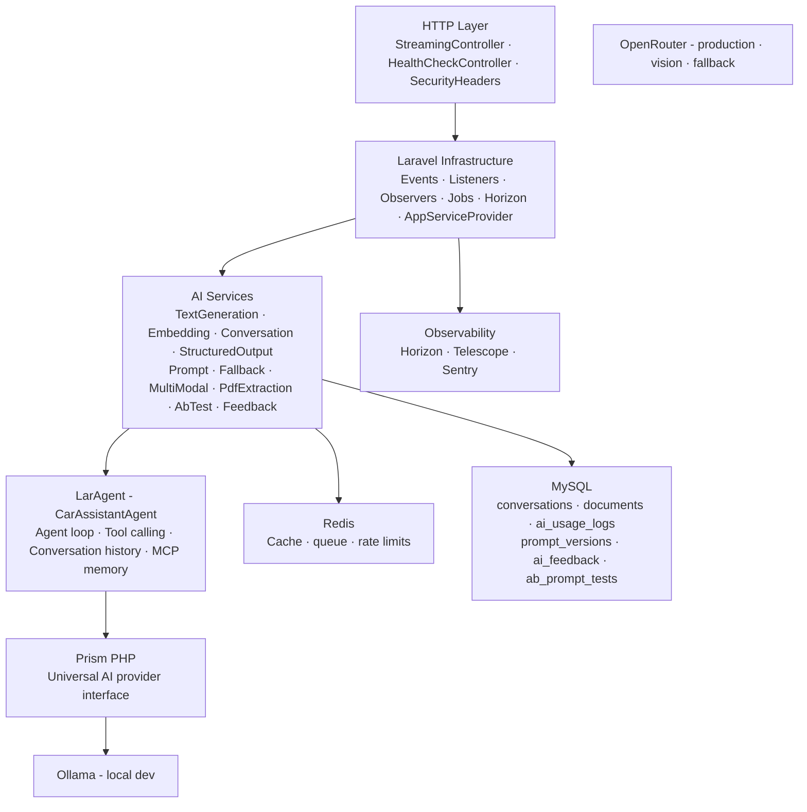

# LaraAI

A reusable Laravel AI integration template covering every major AI pattern - text generation, structured output, tool calling, RAG, agents, streaming and more. Built to be cloned and adapted for any domain by swapping domain-specific classes while keeping the entire infrastructure intact.

> **Example domain:** car dealership. Replace it with real estate, medical, e-commerce - the AI layer stays the same.

---

## Why LaraAI

LaraAI builds the full production layer around LarAgent.

LarAgent handles the agent loop - tool calling, conversation history, MCP memory. LaraAI handles everything a real business needs on top of that: cost tracking, rate limiting, response caching, provider fallback, prompt versioning, async processing, streaming, vision, PDF extraction, webhook ingestion, A/B prompt testing, user feedback and full observability.

Without LaraAI, LarAgent works but is not production-ready. Together they form a complete, observable, cost-controlled AI system that can be cloned and adapted for any domain.

> "I built the production infrastructure layer around LarAgent."

---

## Tech Stack

| Tool                  | Purpose                                                                   |
| --------------------- | ------------------------------------------------------------------------- |
| **Laravel 12**        | Application framework                                                     |
| **Prism PHP**         | Universal AI provider interface - swap providers without changing code    |
| **LarAgent**          | Agent framework built on Prism - tool loops, memory, conversation history |
| **Ollama**            | Local model execution for development (free, private, offline)            |
| **OpenRouter**        | Production AI provider - access to GPT-4, Claude, Gemini and more         |
| **Redis**             | Cache driver + queue backend                                              |
| **Laravel Horizon**   | Queue monitoring dashboard                                                |
| **Laravel Telescope** | Development debugging dashboard                                           |
| **Pest**              | Testing framework                                                         |
| **Docker**            | Containerized development environment - one command setup                 |

---

## Architecture



**Provider strategy:**

```
Development → Ollama (local, free, private)
Production  → OpenRouter (paid, fast, powerful)
Fallback    → OpenRouter → Ollama (automatic)
Vision      → OpenRouter always (Ollama has no vision support)
```

---

## Features

### AI Patterns

- Text generation with prompt/response flow
- Structured output - force JSON schema, decode to typed PHP array
- Tool calling - AI decides which PHP function to call and when
- Stateful conversations - database-backed history on top of stateless LLMs
- Embeddings + semantic search - cosine similarity over stored vectors
- RAG (Retrieval-Augmented Generation) - AI answers from your own data
- LarAgent - full agent loop with tools, memory and MCP support
- Streaming - SSE responses from AI to browser in real time
- Multi-modal - image input via OpenRouter + Gemini
- PDF extraction - schema-driven structured data extraction from PDFs via vision AI
- Prompt versioning - store, activate and roll back system prompts from DB

### Production Infrastructure

- Cost tracking - log token usage and estimated cost per AI call
- Rate limiting - per-user, per-feature call limits backed by Redis
- Response caching - skip duplicate AI calls with hashed cache keys
- Automatic fallback - if primary provider fails, retry with secondary
- Async AI jobs - `ShouldQueue` jobs with retry, batching, failure handling
- Webhook ingestion - receive files from external systems, verify HMAC-SHA256 signature, process async
- A/B prompt testing - route sessions to competing prompt variants, track positive vote rate per variant
- User feedback loop - thumbs up/down votes on AI responses stored in DB, linked to A/B variants
- Health check endpoint - real embedding call verifies full AI pipeline, not just server ping
- Config-driven - zero hardcoded values, everything via `config/ai.php` + `.env`
- Horizon dashboard - real-time queue monitoring at `/horizon`
- Telescope integration - full request/job/query debugging at `/telescope`
- Docker - one command setup with MySQL, Redis, Ollama containers
- GitHub Actions CI - tests run automatically on every push and pull request
- Postman collection - import `postman_collection.json` to test all endpoints
- Event-driven side effects - decoupled listeners for usage tracking and Slack cost alerts
- Model observers - automatic Redis cost aggregation on every AI log entry
- DB indexes - performance indexes on high-traffic query columns
- Input validation - prompt size limits and basic injection filtering via FormRequest
- Security headers - XSS, clickjacking and MIME sniffing protection on every response
- Sentry integration - production exception tracking with full stack traces and alerts
- Demo seeder - 55 realistic car listings indexed as embeddings, RAG works out of the box

### Code Quality

- 51 Pest tests passing - services, jobs, observers, controllers, mocked AI responses
- Clean service architecture - one responsibility per class
- Docblocks on every class and method
- Laravel Pint formatting enforced

---

## Requirements

- Docker + Docker Compose
- OpenRouter API key (for production models and vision features)
- 8GB+ RAM recommended (for local Ollama models)

---

## Quick Start

```bash
git clone git@github.com:bokhuuu/LaraAI.git
cd LaraAI
cp .env.example .env
docker compose up -d
docker exec LaraAI php artisan key:generate
docker exec LaraAI php artisan migrate
docker exec LaraAI php artisan db:seed
```

Then open `http://localhost:8080` in your browser.

---

## API Endpoints

| Method | Endpoint           | Description                              |
| ------ | ------------------ | ---------------------------------------- |
| GET    | `/api/ai/health`   | Health check - verifies full AI pipeline |
| POST   | `/api/ai/feedback` | Submit thumbs up/down on AI response     |
| POST   | `/api/webhook`     | Receive file from external system        |
| GET    | `/stream`          | SSE streaming AI response                |
| GET    | `/chat`            | Browser chat interface                   |
| GET    | `/horizon`         | Queue monitoring dashboard               |
| GET    | `/telescope`       | Development debugging dashboard          |

Import `postman_collection.json` into Postman to test all endpoints immediately.

---

## Database Tables

| Table                         | Purpose                                           |
| ----------------------------- | ------------------------------------------------- |
| `conversations`               | Conversation sessions                             |
| `messages`                    | Messages per conversation (role/content)          |
| `documents`                   | Text + embedding vectors for RAG                  |
| `ai_usage_logs`               | Token usage and cost per AI call                  |
| `prompt_versions`             | Versioned system prompts                          |
| `ai_feedback`                 | User thumbs up/down votes on AI responses         |
| `ab_prompt_tests`             | A/B test definitions with two competing prompts   |
| `ab_prompt_results`           | Per-session variant assignments and vote outcomes |
| `laragent_messages`           | LarAgent conversation history                     |
| `laragent_session_identities` | LarAgent session metadata                         |
| `failed_jobs`                 | Failed job records                                |
| `job_batches`                 | Batch job tracking                                |

---

## Adapting to a New Domain

To use this template for a new domain (e.g. real estate):

| Component           | What to Change                                          |
| ------------------- | ------------------------------------------------------- |
| `CarAssistantAgent` | Delete. Scaffold your own Agent extending LarAgent.     |
| `AnalyzeCarJob`     | Delete. Scaffold your own domain job.                   |
| `ProcessWebhookJob` | Delete. Scaffold your own file processing logic.        |
| `CarListingsSeeder` | Delete. Scaffold your own domain seeder with real data. |
| `searchByBrand()`   | Replace with your domain search tool.                   |
| `getAllCars()`      | Replace with your domain DB query.                      |
| `prompt_versions`   | Create new prompts for your domain.                     |
| `config/ai.php`     | Update models, providers, rate limits and cost rates.   |

Everything else - services, infrastructure, config - stays identical.

---

## Known Limitations

- **RAG at scale** - `EmbeddingService::search()` loads all documents into PHP memory for comparison. For 1000+ documents switch to PostgreSQL with the pgvector extension for DB-level vector search.
- **Context window** - `ConversationService` sends the full message history on every turn. For very long conversations consider summarization. LarAgent has built-in summarization for agent conversations.
- **Ollama model size** - large models (llama3.1:8b) require 8GB+ RAM. Smaller hardware should use `llama3.2:1b`.
- **MCP memory server** - requires Node.js in the runtime environment. Not available in serverless deployments.
- **Streaming + conversation history** - the `/chat` endpoint uses stateless streaming. Full conversation history requires `ConversationService` separately.
- **Webhook signature** - HMAC-SHA256 verification with shared secret. For higher security consider rotating secrets or per-sender keys.
- **PII redaction** - not implemented. Add scrubbing layer before AI calls in production.

---

## Roadmap

- ✅ Text generation, structured output, tool calling, RAG, embeddings
- ✅ LarAgent with tools, MCP memory, database history
- ✅ Streaming SSE to browser
- ✅ Cost tracking, rate limiting, response caching, provider fallback
- ✅ Prompt versioning with rollback
- ✅ Async jobs, event-driven architecture, model observers
- ✅ Multi-modal vision + PDF extraction
- ✅ Docker, GitHub Actions CI, Postman collection
- ✅ Security hardening, DB indexes, Sentry
- ✅ Health check with real embedding pipeline verification
- ✅ User feedback loop - thumbs up/down stored in DB
- ✅ A/B prompt testing - variant assignment, vote tracking, results comparison
- ✅ Webhook support - HMAC-verified file ingestion, async processing
- ✅ Token budget middleware - circuit breaker for monthly token spend per user
